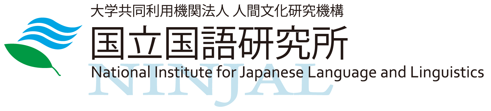

<table><tr><td>
<h1>日本語言語資源の構築と利用性の向上</h1>
<a href="https://www.anlp.jp/nlp2023/">言語処理学会第29回年次大会（NLP2023）</a> 併設ワークショップ

日時：2023年3月17日(金) 9:30〜18:00  
</td><td style="vertical-align:top;">
    
</td>
</tr><tr><td colspan="2">
会場：沖縄コンベンションセンターB1会議室(サテライトA2会議室)＋オンライン中継(Zoom)のハイブリッド開催  

共催：株式会社 Studio Ousia 
　　　国立国語研究所共同研究プロジェクト「実証的な理論・対照言語学の推進」 
　　　科学研究費補助金・基盤研究(A)「計算知と人知の融合による汎用言語理解基盤の構築」
</td></tr></table>

  

    <a href="https://www.ousia.jp/ja/" target="_blank" rel="noreferrer">
      

    </a>
  

  

    <a href="https://www.ninjal.ac.jp/" target="_blank" rel="noreferrer">
      

    </a>
  

  
Twitter公式アカウント<a href="https://twitter.com/jedws" target="_blank" rel="noreferrer">@jedws</a>

## What's new
2023/03/17 ワークショップは終了しました。たくさんのご参加、ありがとうございました。 
2023/03/01 [ワークショッププログラム](program)を更新しました。 

## 趣旨
自然言語処理における各種タスクのモデルを訓練、評価、分析するためには、注釈付きコーパスや事前学習済みモデルなどの言語資源が必要不可欠である。
英語を中心に多くの言語資源が構築、公開されているが、日本語では多くない。
この状況は、日本語における自然言語処理の迅速な発展を阻害する要因となっている。

本ワークショップでは、日本語における言語資源の構築手法そのものに加えて、言語資源の公開方式、利用性を高めるための著作権・ライセンス設定、タスクの複合化など、普及および応用を容易にするための研究について集
中的に議論する。これによって、日本語言語資源の公開の流れを加速し、日本語自然言語処理のさらなる発展および生産性向上につなげていきたい。

## 招待講演：知識拡張型言語モデルLUKE

  
講演者: 山田育矢 先生<small>（<a href="https://www.ousia.jp/ja/">株式会社Studio Ousia</a>, Co-founder, Chief Scientist）</small>

  
概要

  
LUKEは、単語とエンティティを扱う知識拡張型言語モデルで、エンティティに関する知識が重要となるダウンストリームタスクを良い性能で解くことができる。このモデルはHuggingface Transformersに組み込まれており、簡単に使うことができる。本講演では、LUKE (EMNLP 2020) 、多言語版LUKE (ACL 2022)、LUKEのエンティティリンキングへの応用 (NAACL 2022, EMNLP Findings 2022)、日本語版LUKEまでの取り組みを紹介する。

  
略歴

  
（株）Studio Ousiaを共同創業し、自然言語処理の技術開発に従事。2000年に（株）ニューロンを起業し、2005年に売却。2007年にStudio Ousiaを設立。博士（学術）。理化学研究所AIP客員研究員。Kaggle Master。

## タイムテーブル

[プログラムの詳細はこちらから](program)

<table id="program_table">
  <tbody>
    <tr>
      <td class="program_time">9:30-9:35</td>
      <td>オープニング</td>
    </tr>
    <tr>
      <td class="program_time">9:35-10:30</td>
      <td><a href="program/#日本語データセットの構築(1)">日本語データセットの構築(1) [一般発表2件]</a></td>
    </tr>
    <tr>
      <td class="program_time">10:40-11:40</td>
      <td><a href="program/#日本語データセットの構築(2)">日本語データセットの構築(2) [一般発表2件・LT2件]</a></td>
    </tr>
    <tr>
      <td class="program_time">11:50-13:15</td>
      <td><a href="program/#多言語・多分野の言語資源の構築">多言語・多分野の言語資源の構築 [一般発表3件・LT3件]</a></td>
    </tr>
    <tr>
      <td class="program_time">13:15-14:20</td>
      <td>昼休憩</td>
    </tr>
    <tr>
      <td class="program_time">14:20-15:20</td>
      <td><a href="program/#招待講演">招待講演（山田育矢先生）</a></td>
    </tr>
    <tr>
      <td class="program_time">15:30-17:05</td>
      <td><a href="program/#事前学習モデルの構築と利用">事前学習モデルの構築と利用 [一般発表3件・LT2件]</a></td>
    </tr>
    <tr>
      <td class="program_time">17:15-18:00</td>
      <td><a href="program/#パネル(総合討論)・クロージング">パネル(総合討論)・クロージング</a></td>
    </tr>
  </tbody>
</table>

## NLP2023 Slack チャンネル
NLP2023参加者限定Slackワークスペースで、当ワークショップのチャンネルが用意されています。  
#

<!-- div class="slack-channel-container">

#32-workshop2-日本語における評価用データセットの構築と利用性の向上

## スケジュール
- 2022/12/01 (木)	Webサイト公開
- 2022/12/21 (水)	一般発表・ライトニングトーク申込受付開始
- 2023/01/10 (火)	NLP2023事前参加登録受付開始
- 2023/02/13 (月)	一般発表申込締切・NLP2023事前参加登録締切
- 2023/02/21 (火)	プログラム公開
- 2023/02/28 (火)	ライトニングトーク申込締切
- 2023/03/10 (金) 正午まで	NLP2023直前参加登録締切
- 2023/03/13 (月)	発表スライド提出期限
- 2023/03/17 (金)	ワークショップ当日

## 発表募集要項
### 募集する発表内容
日本語のデータセットや事前学習済みモデルなどの言語資源を構築されている方は，論文では語られない苦労話を含めて，構築ノウハウをぜひご発表ください．これから言語資源の構築を始めようとしている方には，その構築の狙いについてご発表をお願いします．また，自然言語処理に関する知識をお持ちかどうかを問わず，金融や医療といった応用領域の業務知見から，特定ドメインの日本語言語資源の必要性を伝えるご発表を歓迎します．さらに，日本語言語資源の充実にむけて克服すべき障壁や課題，そしてそれらの解決に向けたアイディアのご発表も歓迎します．下記に内容の例を示しますが，これらにとどまらず様々な取り組みについてご発表をお待ちしています．

#### 日本語データセットの構築と公開

- 各種日本語データセットのアノテーションにおけるノウハウや問題点の共有
- データセットの公開方法(ライセンスなど)に関するノウハウや問題点の共有
- 評価用データセットでの性能評価結果の共有・公開

#### 日本語事前学習済みモデルの構築と公開

- Webデータのクレンジング手法およびドメイン特化のための追加データ構築
- Webデータや各種企業内データを用いた事前学習モデルの構築と公開
- 超大規模日本語モデルの構築と公開

#### 日本語言語資源不足の解決と自然言語処理研究開発・産業応用の加速に向けた取り組み

- 自然言語処理研究開発の現場でどのような日本語言語資源が必要とされているか
- 産業応用において強い需要を持つ日本語言語資源の公開を通じた日本語の国際的市場価値の維持向上
- デファクトスタンダード化した英語ベンチマークに比肩する日本語ベンチマークをどのように構築していくか

### 発表スライドの事前提出について
- 発表で使用するスライドをPDF形式で事前に提出いただきます（論文の提出は不要です）．
- 公開を希望されない場合を除いてスライドは本サイトに掲載いたします．問題が生じる懸念がある場合は修正をお願いすることがありますので，予めご了承ください．
- 発表スライドの著作権は発表者に帰属しますが，CC BY 4.0([Creative Commons Attribution 4.0 International License](https://creativecommons.org/licenses/by/4.0/deed.ja)) で公開することに同意していただきます．

### 発表方法
- 一般発表・ライトニングトークを含む全てのセッションについて現地会場(沖縄コンベンションセンター)またはオンライン(Zoom)のどちらからでも発表できます
- 現地会場・オンラインを問わず発表資料は発表者所有のPCからZoomで画面共有を行っていただきます

### 発表種別
#### 一般発表
- 発表15〜35分 + 質疑5分
- 発表申込時に発表者・タイトル・概要(400字程度)を提出いただきます

#### ライトニングトーク
- 発表5分 + セッションの最後にまとめて質疑を行います
- 発表申込時に発表者・タイトル・概要(200字程度)を提出いただきます

※発表希望者多数の場合，一般発表からライトニングトークへの振り分けや不採択とさせていただく場合がありますので，予めご了承ください．

### 発表申込期間
※発表申込は締め切りました。

#### 一般発表
- 2022年12月21日(水)〜2023年2月13日(月)

#### ライトニングトーク
- 2022年12月21日(水)〜2023年2月28日(火)

### 発表スライド提出期限
- 2023年3月13日(月)

### 発表申し込みフォーム
※発表申込は締め切りました。

## 参加申し込み
本ワークショップは言語処理学会第29回年次大会(NLP2023)の併設ワークショップとして開催されます．
本ワークショップにおける発表・参加のためには[NLP2023](https://www.anlp.jp/nlp2023/)に参加登録（有料）を行う必要があります．
NLP2023の参加登録期間は，事前登録が2023/01/10〜02/13，直前登録は2023/03/01〜10正午，当日登録は2023/03/13〜17正午です．

## 提案者
- 浅原正幸 <small>国立国語研究所</small>
- 河原大輔 <small>早稲田大学</small>
- 久保隆宏 <small>アマゾンウェブサービスジャパン合同会社</small>
- 坂口慶祐 <small>東北大学</small>
- 柴田知秀 <small>ヤフー株式会社</small>
- 松田寛 <small>株式会社リクルート Megagon Labs</small>

問い合わせ先 jlr2023 (at) googlegroups.com
